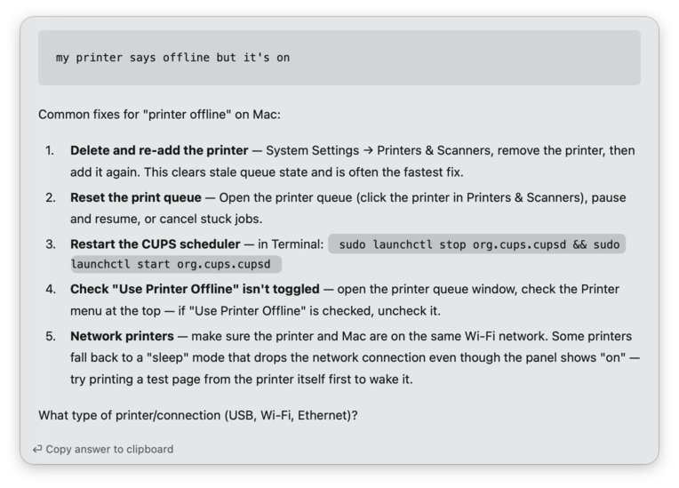

# Claude CLI for Alfred

An Alfred workflow that sends a prompt to the [Claude CLI](https://docs.claude.com/en/docs/claude-code)
and renders the answer as Markdown — right inside Alfred.

👍 No API key or token billing - requests go through your existing Claude CLI
login, so they use your current Claude plan (e.g. Pro/Max). There's no separate
API key to manage and no per-token API charges to set up for this workflow.

## Usage

Type `cla` followed by your prompt:

```
cla explain recursion in one line
cla write a git command to undo the last commit but keep the changes
cla summarise the difference between TCP and UDP
```


Press Enter. The prompt is shown on top, followed by Claude's Markdown answer.




## Requirements

- macOS with [Alfred **5.5 or later**](https://www.alfredapp.com/) and the **Powerpack**
  (the Text View used to render answers was introduced in Alfred 5.5)
- The [Claude CLI](https://docs.claude.com/en/docs/claude-code) installed and authenticated
  (check the path with `which claude`)

## Install

1. Download the latest `alfred-claude-cli-vX.Y.Z.alfredworkflow` from the
   [Releases](https://github.com/markusloeffler/alfred-claude-cli/releases) page.
2. Double-click it to import into Alfred.
3. Open the workflow's configuration and set:
   - **Claude CLI Path** — path to your `claude` binary (default `~/.local/bin/claude`; find yours with `which claude`)
   - **Model** — the model to use (default `sonnet`)

## License

[MIT](LICENSE)

## Credits

Based on learnings from [truongvinht/alfred-claude-workflow](https://github.com/truongvinht/alfred-claude-workflow).
